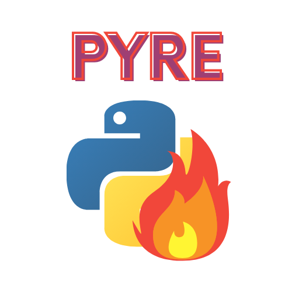
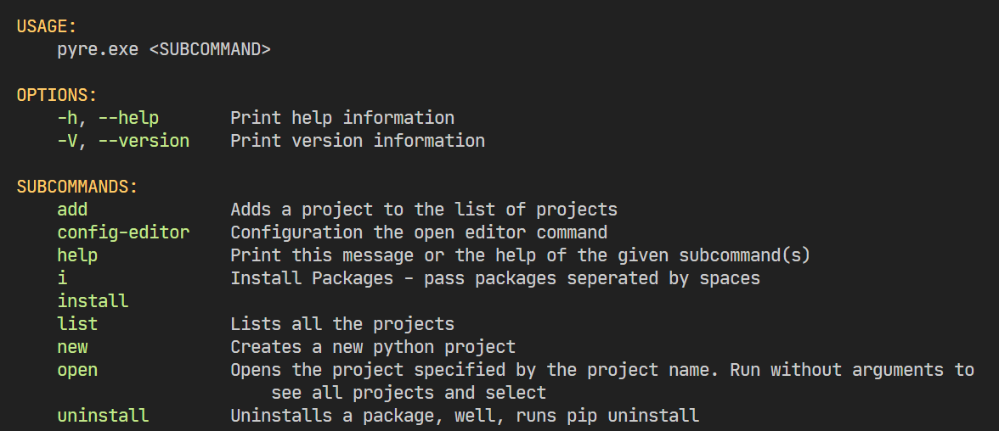
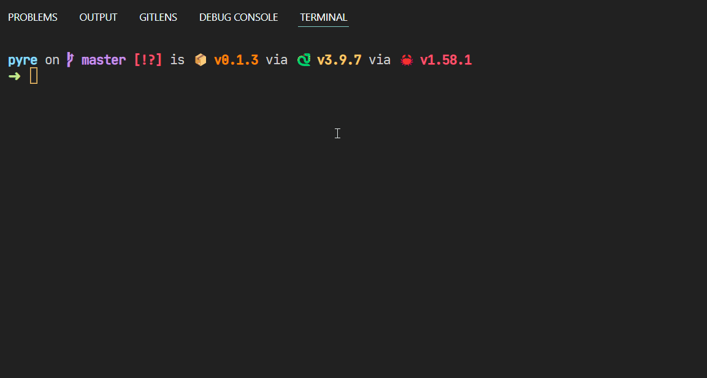
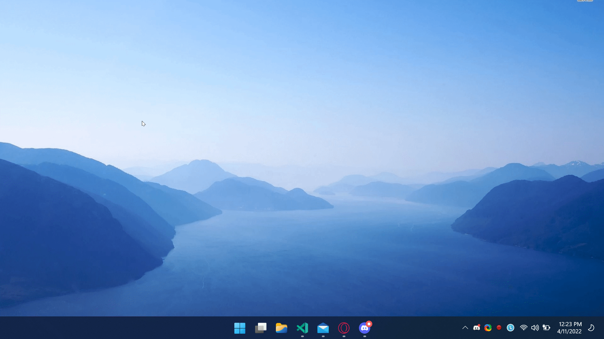
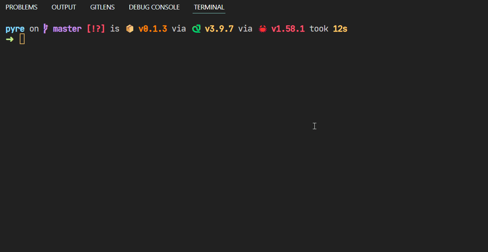
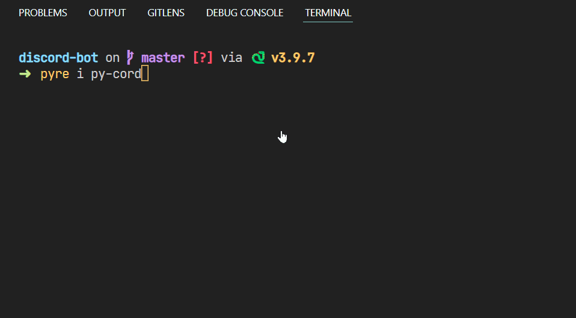

## Pyre

Create, open, manage your Python projects with ease.

***
> This project was made as a joke, but somehow it's really useful, so I'm publishing it
  
# 👀 Why Pyre?

- I currently have 48 projects in Python projects directory, and had to navigate and find them. With Pyre, I just have to run one command to easily open the project, right in the editor I want. `pyre open <project_name>` does it for me.
- I'm a procrastinator, and initialising Virtual environment, creating gitignore, etc. was a pain, so I basically used my old project - [create-python-project](https://github.com/dhravya/create-python-project) and modified it to work with pyre. `pyre new project_name` does it all, really quickly.
- Whenever I installed dependencies, I forgot to add them in the requirements.txt file, so `pyre i <dependencies>` automatically updates the requirements file, very convenient for me
- It's just a tool to make Python development experience better, like Cargo does, for Rust.

# 📷 Screenshots, and demonstrations

### Help Command

### New Project command

> You can configure your open editor to whatever you want. For my case, I have set it to `code-insiders.cmd`. To config editor, use `pyre config-editor <open_command>`

As it says, all new project names and their paths are saved to the system default for LocalData, I've used the `dirs` crate to get location, and create a `pyre.json` in the directory.

You can also add projects manually. So the project manager part is irrespective of programming language, I've added the Pyre directory, to quickly open this project. It will search for the project (add project using `pyre add <name> [path (defaults to the current path)`])

### To list all projects and interactively open them, 

### Installing dependencies (and automatically adding to requirements.txt)

# 📃 TODO
- Add (or Fix) the run command (the only way I could figure out was using `std::process::Command`, but then how will I take input etc? Asked for help, recommended to use Python interpreter...)
- The stuff inside [manager.rs](./src/manager.rs) is kinda badly implemented 
- Pip install isn't *interactive* i mean, it just prints the output *after* installation is done
- The config commands should be better, maybe under the `config` subcommand where ppl can pass args to do stuff (like get the data file location, change default editor command, etc.)

## Support
- Follow me on [Github](https://github.com/dhravya) , [Twitter](https://twitter.com/dhravyashah) and [Dev.to](https://dev.to/dhravya) 
- [Buy me a Kofi](https://ko-fi.com/dhravya)